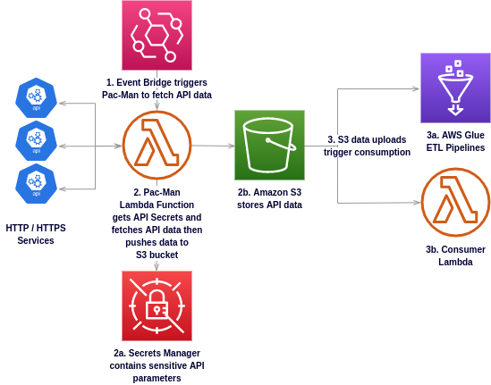

[](https://crates.io/crates/pac-man)
[](https://github.com/gregl83/pac-man/blob/master/LICENSE)
[](https://github.com/gregl83/pac-man/actions?query=workflow%3ACI+branch%3Amain)
# pac-man


AWS Lambda streaming API consumer.

Use this generic Lambda service to consume APIs and persist response data in S3. Once the data is in S3, it can be consumed by any number of AWS cloud services.

## Stability

Experimental

## Architecture



## Service Dependencies

**Required**

- [AWS Lambda](https://aws.amazon.com/lambda/) as executor of pac-man tasks.
- [AWS S3](https://aws.amazon.com/s3/) as Destination for data.

**Optional**

- [GitHub Actions CI/CD](https://github.com/features/actions) to deploy pac-man.
- [AWS Secrets Manager](https://aws.amazon.com/secrets-managser/) for sensitive request or persistence parameters.
- [AWS EventBridge](https://aws.amazon.com/eventbridge/) to trigger pac-man runs.

## Usage

AWS Lambda deployments can be triggered in a variety of ways. Configuring events to trigger your Lambda functions involves parameters specific to each use-case.

Uncomfortable with sensitive values in plaintext?

*Good, you should be!*

AWS Secrets Manager is supported, using a modifier, with the following value expression: `{:secrets:<name>:<key>}`.

**Minima Lambda Event**

```json
{
  "source": {
    "scheme": "https",
    "hostname": "example.com"
  },
  "destination": {
    "region": "us-east-1",
    "collection": "bucket-name",
    "name": "key"
  }
}
```

**Maxima Lambda Event**

```json
{
  "mods": [
    {
      "name": "chunks",
      "start": 0,
      "end": 100,
      "chunk": {
        "length": 10      
      },
      "bytes": 100
    },
    {
      "name": "secrets",
      "region": "us-east-1"
    },
    {
      "name": "uuid"    
    }
  ],
  "source": {
    "headers": {
      "Accepts": [
        "text/json"
      ]
    },
    "scheme": "https",
    "username": "pseudo",
    "password": "{:secrets:pac-man:pw}",
    "hostname": "example.com",
    "port": 8080,
    "path": "/follow/the",
    "params": {
      "from": "{:chunks:chunk:start}",
      "to": "{:chunks:chunk:end}"    
    },
    "fragment": "/yellow/brick/road"
  },
  "destination": {
    "region": "us-east-1",
    "collection": "bucket-name",
    "name": "key-{:uuid}"
  }
}
```

**Optional Event Fields**

`delta( minima.fields, maxima.fields )`

### Modifiers

Modifiers or `mods` implement functionality that modifies standard behavior.

Mods are toggled within the `mods` body of a Lambda Event.

#### Chunks

`{:chunks:chunk:start}`
`{:chunks:chunk:end}`
`{:chunks:chunk:index}`
```json
{
  "name": "chunks",
  "start": 0,
  "end": 100,
  "chunk": {
    "length": 10      
  },
  "bytes": 100
}
```

`bytes` is a special configuration that denotes the minimum Content-Length header required to continue. It can be used to decide when a last page has been reached.

#### Secrets

`{:secrets:<name>:<key>}`
```json
{
  "name": "secrets",
  "region": "us-east-1"
}
```

#### Uuid

`{:uuid}`
`{:uuid:<key>}`
```json
{
  "name": "uuid"
}
```

Using a key with the `uuid` modifier allows reference to the same `uuid` using a HashMap cache for a given run.

## Testing

Lambda functions can be executed with the help of [Docker](https://github.com/awslabs/aws-lambda-rust-runtime#docker).

### Docker Containers

[docker-test.sh](/docker-test.sh) launches a Lambda build using Docker.

#### Environment Variables

- AWS_SECRET_ACCESS_KEY
- AWS_ACCESS_KEY_ID

#### 1. Build Package

```bash
../pac-man$ docker run --rm \
      -v ${PWD}:/code \
      -v ${HOME}/.cargo/registry:/root/.cargo/registry \
      -v ${HOME}/.cargo/git:/root/.cargo/git \
      softprops/lambda-rust
```

#### 2. Unzip Package

```bash
../pac-man$ unzip -o \
      target/lambda/release/pac-man.zip \
      -d /tmp/lambda
```

#### 3. Run Unzipped Package
```bash
../pac-man$ docker run \
      -i -e DOCKER_LAMBDA_USE_STDIN=1 \
      -e AWS_ACCESS_KEY_ID=${AWS_ACCESS_KEY_ID} \
      -e AWS_SECRET_ACCESS_KEY=${AWS_SECRET_ACCESS_KEY} \
      --rm \
      -v /tmp/lambda:/var/task \
      lambci/lambda:provided
```

## References

- [W3 URI Specification](https://www.w3.org/Addressing/URL/uri-spec.html)

## License

[MIT](LICENSE)
